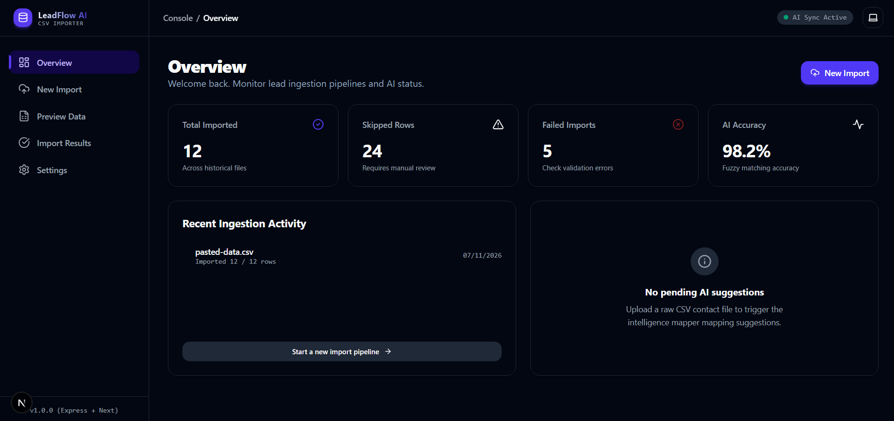
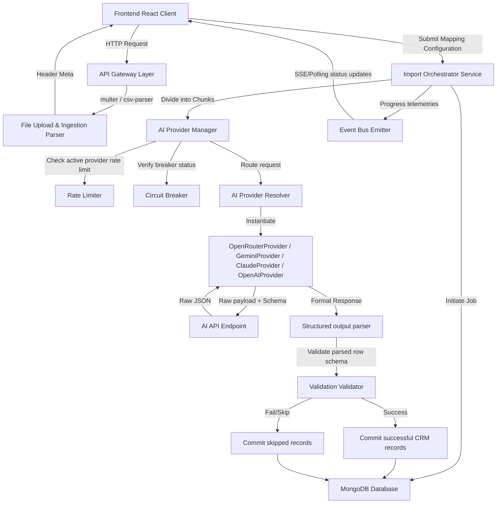
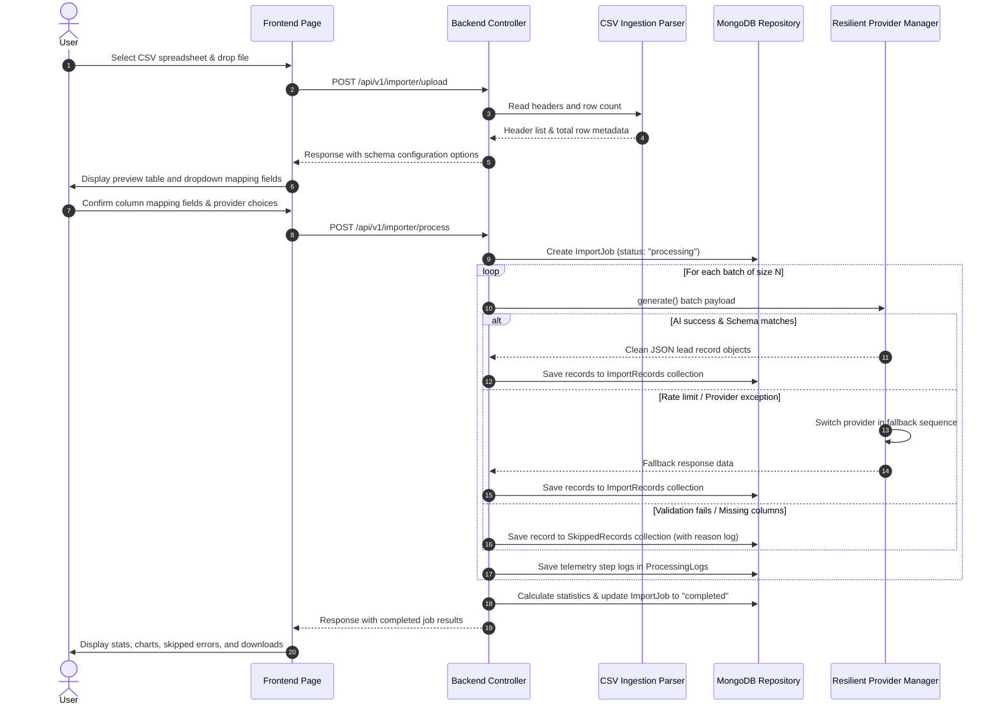

# AI CSV Importer

> **Enterprise AI-Powered CSV to CRM Import & Normalization System**

An advanced, production-ready system designed to handle high-throughput, error-tolerant ingestion of contact spreadsheets. The pipeline maps arbitrary headers, sanitizes names, formats phone numbers, normalizes corporate domains, and inserts records into CRM database structures using state-of-the-art AI parsing engines. It features native rate-limiting, circuit breakers, parallel processing, and dynamic provider fallbacks.

---

## Badges

[](https://www.typescriptlang.org/)
[](https://nodejs.org/)
[](https://expressjs.com/)
[](https://nextjs.org/)
[](https://www.mongodb.com/)
[](https://www.docker.com/)
[](./LICENSE)
[](#)
[](#)

---

## Table of Contents

- [Overview](#overview)
- [Features](#features)
- [Screenshots](#screenshots)
- [Live Demo](#live-demo)
- [Tech Stack](#tech-stack)
- [Project Structure](#project-structure)
- [System Architecture](#system-architecture)
- [CSV Import Flow](#csv-import-flow)
- [Installation](#installation)
- [Running the Project](#running-the-project)
- [Environment Variables](#environment-variables)
- [AI Providers](#ai-providers)
- [Database Schema](#database-schema)
- [API Documentation](#api-documentation)
- [Logging](#logging)
- [Configuration](#configuration)
- [Deployment](#deployment)
- [Testing](#testing)
- [Performance](#performance)
- [Security](#security)
- [Troubleshooting](#troubleshooting)
- [Roadmap](#roadmap)
- [Contributing](#contributing)
- [License](#license)
- [Author](#author)

---

## Overview

### What this project is
The **AI CSV Importer** is a robust web application built to solve the classic enterprise problem of importing unstructured spreadsheets into structured CRM schemas. By combining structured JSON-schema prompts, parallel worker pools, and fallback AI providers, the system safely processes dirty spreadsheets, corrects human formatting errors, and isolates invalid data.

### Why it exists
spreadsheets received from lead vendors or sales agents are notoriously messy. Mismatched headers, incorrect phone extensions, unformatted country codes, and invalid email formats plague standard database import tools. This project automates normalization by using Large Language Models (LLMs) to map, sanitize, and validate rows on-the-fly, transforming unstructured spreadsheets into pristine, clean records.

### Who should use it
- **Sales & Marketing Operations**: To import multi-vendor lead lists without spending hours manually mapping columns in Excel.
- **Developers & DevOps Engineers**: As a scaffold for high-throughput, queue-based AI document pipelines requiring robust error-handling, rate limits, and fallback strategies.
- **Enterprise Integrators**: Seeking to ingest legacy files into modern PostgreSQL, Salesforce, or Hubspot databases.

---

## Features

- **Ingestion Mechanisms**:
  - `[x]` **Drag & Drop Upload**: Instant parsing of uploaded local CSV files.
  - `[x]` **Paste CSV Content**: Raw text input box for quick ad-hoc data pasting.
- **Mapping & Review UI**:
  - `[x]` **Interactive Columns Mapping**: Visual preview of parsed CSV rows alongside dropdowns to match source fields to CRM fields.
  - `[x]` **Validation Threshold Settings**: Configurable certainty settings to isolate rows failing criteria.
- **Advanced Processing Pipeline**:
  - `[x]` **Centralized Request Queue**: Priority scheduler limits concurrent connections to avoid API starvation.
  - `[x]` **Adaptive Batch Processing**: Divides records into chunk sizes optimized for specific models.
  - `[x]` **Zod Structured Output Validation**: Enforces exact JSON schemas at the API level (strict mode).
- **Resiliency & Fault Tolerance**:
  - `[x]` **Provider Fallback Engine**: If a preferred provider fails, requests route down an ordered backup list (e.g. Gemini $\rightarrow$ OpenAI $\rightarrow$ Mock).
  - `[x]` **Circuit Breakers**: Bypasses degraded API endpoints for 30 seconds after 3 consecutive errors.
  - `[x]` **Rate Limiters**: Restricts tokens/requests per minute at a per-provider level to prevent 429 throttling.
- **History & Telemetry**:
  - `[x]` **Import History Dashboard**: Full audit trails for past uploads with completed/skipped counts, success rates, latency, and costs.
  - `[x]` **Processing Logs Telemetry**: Real-time pipeline step logs available directly in the UI.
  - `[x]` **Data Export**: Single-click downloads of imported CRM data in **JSON** or **CSV** formats.
- **Aesthetic UI/UX**:
  - `[x]` **Dark Mode Support**: Seamless light/dark/system theme switches.
  - `[x]` **Glassmorphism Design**: Sleek typography, micro-animations, and responsive layouts.

---

## Screenshots

### Overview Dashboard


### New Import


### Preview & Column Mapping


### AI Extraction Pipeline (Processing)


### Import Results


---

## Live Demo

| | Link |
|---|---|
| 🌐 **Frontend** | [ai-csv-importer-xi.vercel.app](https://ai-csv-importer-xi.vercel.app/) |
| ⚙️ **Backend API** | [ai-csv-importer-fv8q.onrender.com](https://ai-csv-importer-fv8q.onrender.com) |
| 📁 **GitHub Repository** | [Akshad11/AI-CSV-Importer](https://github.com/Akshad11/AI-CSV-Importer) |

---

## Tech Stack

### Frontend
- **Core**: TypeScript, React 19 (Next.js 16 - Turbopack)
- **State Management**: Zustand
- **Form Validation**: React Hook Form, Zod
- **Styling**: Vanilla CSS, TailwindCSS v4, Lucide Icons, Framer Motion
- **HTTP Client**: Axios

### Backend
- **Core**: TypeScript, Node.js (v18+), Express (v5)
- **Database ORM**: Mongoose
- **Container Registry / Dependency Injection**: Custom Constructor-based DI Container
- **LLM Integrations**: OpenAI SDK, Google Generative AI SDK, Anthropic SDK
- **Task Runner / Watcher**: TSX

### Database
- **Primary**: MongoDB (v6.0+)

### Infrastructure & Deployment
- **Containerization**: Docker, Docker Compose
- **Orchestration**: VPS, Render, Railway, AWS

---

## Project Structure

```
CSV-CRM/
├── backend/
│   ├── src/
│   │   ├── config/            # Environment variable validation & schema configurations
│   │   ├── core/              # Core abstractions (Retry engines, Circuit breakers, Interfaces)
│   │   ├── container/         # DI Container instantiation and registry
│   │   ├── database/          # Mongoose connections, models, repositories, and seeders
│   │   ├── errors/            # Centralized API error handlers
│   │   ├── middlewares/       # Rate limiters, request loggers, and upload helpers
│   │   ├── modules/           # Functional modules (e.g. Importer route, controllers, services)
│   │   ├── prompts/           # Core AI prompt templates (system and user prompt blueprints)
│   │   ├── services/          # Supporting services (AI managers, providers, token calculators)
│   │   └── server.ts          # Server entry file (initializes DB connection, seeds, starts Express)
│   ├── tests/                 # Full test suites (Unit, Integration, Contract, E2E, Performance)
│   ├── package.json           # Backend dependency mappings and runners
│   └── tsconfig.json          # TypeScript configurations
└── frontend/
    ├── src/
    │   ├── app/               # Next.js Pages Router equivalents (Import, Preview, Results, Settings)
    │   ├── components/        # Visual components (Previews, Tables, Modals, Headers, Upload cards)
    │   ├── store/             # Global Zustand stores (Settings, Results, Preview states)
    │   ├── types/             # Common TypeScript interfaces
    │   └── config/            # Client configuration keys
    ├── package.json           # Frontend dependency mappings
    └── tailwind.config.js     # CSS styling tokens
```

---

## System Architecture

The import system separates concerns into layers, allowing modular additions of database repositories and AI providers.



---

## CSV Import Flow

Processing spreadsheets is carried out step-by-step to prevent timeouts and preserve data validation audits.



---

## Installation

### Prerequisites
- **Node.js** (v18.x or v20.x recommended)
- **MongoDB** (Local instance running at port `27017` or a MongoDB Atlas connection string)
- **Git**

### Step-by-Step Setup

1. **Clone the Repository**
   ```bash
   git clone https://github.com/Akshad11/AI-CSV-Importer.git
   cd AI-CSV-Importer
   ```

2. **Configure the Backend**
   ```bash
   cd backend
   npm install
   cp .env.example .env
   ```
   Edit the `.env` file to insert your specific AI provider API keys (see [Environment Variables](#environment-variables)).

3. **Configure the Frontend**
   ```bash
   cd ../frontend
   npm install
   ```

4. **Verify Database Setup**
   Ensure your local MongoDB instance is running, or that the `MONGODB_URI` connection string inside your backend `.env` matches your Atlas cloud database.

---

## Running the Project

### Running in Development

1. **Start Backend Engine**
   ```bash
   cd backend
   npm run dev
   ```
   The backend starts at `http://localhost:5000`. The server console logs will verify MONGODB connection and database seeding actions.

2. **Start Frontend Client**
   ```bash
   cd ../frontend
   npm run dev
   ```
   Next.js starts the development client at `http://localhost:3000` (or `http://localhost:3001` if port 3000 is occupied).

### Building for Production

1. **Build and Start Backend**
   ```bash
   cd backend
   npm run build
   npm run start
   ```

2. **Build and Start Frontend**
   ```bash
   cd ../frontend
   npm run build
   npm run start
   ```

---

## Environment Variables

The backend application is configured using variables declared in a `.env` file in the `backend/` directory.

| Variable Name | Type | Default Value | Description |
| :--- | :--- | :--- | :--- |
| `NODE_ENV` | String | `development` | Deployment environment: `development`, `production`, or `test`. |
| `PORT` | Number | `5000` | Port where the Express API server listens. |
| `MONGODB_URI` | String | `mongodb://localhost:27017/ai_csv_importer` | Connection URI for the MongoDB database instance. |
| `OPENAI_API_KEY` | String | `""` | Secret key used for authenticating with OpenAI's API. |
| `GEMINI_API_KEY` | String | `""` | API Key used for authenticating with Google's Gemini API. |
| `OPENROUTER_API_KEY` | String | `""` | API Key used for authenticating with OpenRouter. |
| `LOCAL_LLAMA_URL` | String | `http://localhost:11434` | Endpoint used for Local Ollama integrations. |
| `OLLAMA_MODEL` | String | `llama3` | Default local LLM model choice running in Ollama. |
| `LOG_LEVEL` | String | `info` | Minimum log logging verbosity: `debug`, `info`, `warn`, `error`. |
| `AI_CONCURRENCY_LIMIT`| Number | `5` | Concurrency limit of parallel worker queues executing. |
| `AI_PROVIDER` | String | `mock` | Default fallback AI provider if none specified. |
| `AI_MODEL` | String | `mock-model` | Default fallback model choice. |
| `AI_FALLBACK_ORDER` | String | `gemini,openai,ollama,mock` | Comma-separated list defining provider redundancy routing. |

---

## AI Providers

The importer wraps providers in uniform interface engines. Supported integrations include:

- **Gemini**: Integrates natively via the `@google/generative-ai` SDK (recommended default choice for high context windows). Supported models: `gemini-3.5-flash`, `gemini-1.5-flash`, `gemini-1.5-pro`, `gemini-flash-lite`.
- **OpenAI**: Integrates via the `openai` SDK. Supported models: `gpt-5`, `gpt-5-mini`, `gpt-5-nano`, `gpt-4o`.
- **OpenRouter**: Accesses thousands of models via the OpenRouter gateway. Uses baseURL redirection. Supported models: `openai/gpt-4o`, `openai/gpt-4o-mini`, `anthropic/claude-3.5-sonnet`.
- **Claude**: Scaffold integration for Anthropic engines via `@anthropic-ai/sdk`. Supported models: `claude-3-5-sonnet`, `claude-3-opus`.
- **Azure OpenAI**: Uses deployment endpoints mapping.
- **Ollama**: Allows local deployments using models like `llama3`, `mistral`, and `qwen2.5-coder:3b`. Bypasses SaaS costs.
- **Mock Provider**: A local, rule-based provider that structures records without hitting external LLM gateways, ideal for test suites and offline demos.

### How to Switch Providers
1. **Application Settings Screen**: Navigate to `/settings` in the UI and select the default Preferred AI Provider. Saving will update settings in MongoDB.
2. **Ad-hoc Processing**: When confirming an ingestion task, you can select the active provider in the settings cards.

---

## Database Schema

Prisine lead states are persisted in MongoDB using Mongoose schemas across 10 collections:

### 1. `ImportJobs`
Stores structural data about parsed spreadsheets and current processing progress.
- `importId` (String, unique indexed): Unique UUID of the import task.
- `status` (String): Enum: `"pending"`, `"parsing"`, `"processing"`, `"completed"`, `"failed"`.
- `rows` (Number): Total rows detected in the CSV file.
- `columns` (Array of Strings): Columns parsed from CSV headers.
- `aiProvider` / `aiModel` (String): Configuration used for the run.

### 2. `ImportRecords`
Pristine, parsed, and validated CRM contact rows.
- `importId` (String, indexed): Associated job reference.
- `originalRowNumber` (Number): Maps back to the spreadsheet row.
- `name` / `email` / `mobile` / `company` / `city` (String): Structured contact fields.
- `aiConfidence` (Number): AI-calculated validation confidence rating (0-100).
- `validationResult` (Mixed): Result of standard structural rules (e.g. valid format validations).

### 3. `SkippedRecords`
Contact rows that failed criteria or returned un-parsable outputs.
- `originalRow` (Mixed): Raw cell data uploaded by the user.
- `reason` (String): Validation error message describing the failure.

### 4. `AIProviders`
Seeded AI Engine configurations.
- `providerName` (String, unique): `"openai"`, `"gemini"`, `"openrouter"`, etc.
- `enabled` (Boolean): Master toggle for selection availability.
- `rateLimits` (Mixed): Token and Request limits configured for the provider.

### 5. `AIModels`
Seeded AI Model lists.
- `provider` (String): Associated provider name.
- `modelName` (String): Technical name (e.g. `openai/gpt-4o-mini`).
- `displayName` (String): User-friendly label.

### 6. `ApplicationSettings`
System-wide defaults.
- `defaultAiProvider` / `defaultModel` (String): Default fallback configurations.
- `batchSize` (Number): records processed in a single chunk.

### 7. `ProcessingLogs`
Real-time task log events.
- `importId` (String): References active job.
- `level` / `module` / `action` / `message` (String): Standard logging properties.

### 8. `PromptConfigurations`
Prompt version control.
- `promptVersion` (String): Semantic version.
- `systemPrompt` / `userPrompt` (String): String prompt blueprints.

### 9. `ImportStatistics`
Aggregated KPIs saved at job termination.
- `imported` / `skipped` / `warnings` (Number): KPI tallies.
- `totalCost` (Number): Cumulative run cost in INR.

---

## API Documentation

### 1. Health Status
- **Route**: `GET /health`
- **Description**: Verification check of server runtime.
- **Response** (200):
  ```json
  {
    "success": true,
    "message": "Server is healthy",
    "timestamp": "2026-07-11T14:02:00Z"
  }
  ```

### 2. Readiness Check
- **Route**: `GET /ready`
- **Description**: Verifies if MongoDB is connected.
- **Response** (200):
  ```json
  {
    "success": true,
    "message": "Database connection is ready"
  }
  ```

### 3. Get Pipeline Ingest Status
- **Route**: `GET /api/v1/importer/status`
- **Description**: Fetches availability checks for AI keys and active global configurations.
- **Response** (200):
  ```json
  {
    "success": true,
    "data": {
      "status": "ready",
      "providers": {
        "openai": true,
        "gemini": true,
        "openrouter": true,
        "ollama": false,
        "mock": true
      },
      "preferredConfig": {
        "defaultAiProvider": "openai",
        "defaultModel": "gpt-5-mini"
      }
    }
  }
  ```

### 4. Upload Spreadsheets (Header Parse)
- **Route**: `POST /api/v1/importer/upload`
- **Description**: Multiparts-upload CSV, parses headers and count.
- **Payload**: Form-data with file property `file`
- **Response** (200):
  ```json
  {
    "success": true,
    "message": "CSV parsed successfully.",
    "data": {
      "headers": ["Name", "E-Mail", "Org", "Mobile Number", "Place"],
      "totalRows": 250,
      "skippedRows": 0,
      "durationMs": 42
    }
  }
  ```

### 5. Execute AI Mapping Pipeline
- **Route**: `POST /api/v1/importer/process`
- **Description**: Ingests, batch-processes, validations, and saves CRM leads.
- **Payload**:
  - `file`: CSV spreadsheat binary.
  - `provider`: AI Provider key (e.g. `openrouter`).
  - `model`: Target model name (e.g. `openai/gpt-4o`).
  - `columnMappings`: JSON mapping string (e.g. `{"Name":"name","E-Mail":"email","Org":"company"}`).
- **Response** (200):
  ```json
  {
    "success": true,
    "message": "CSV processed with AI pipeline successfully.",
    "data": {
      "importId": "9b1deb4d-3b7d-4bad-9bdd-2b0d7b3d4f8a",
      "totalProcessed": 250,
      "successCount": 242,
      "skippedCount": 8,
      "durationMs": 1420
    }
  }
  ```

### 6. Test AI Connection
- **Route**: `POST /api/v1/ai/test`
- **Description**: Checks key connection logic by querying selected model with quick test string.
- **Payload**:
  ```json
  {
    "provider": "openrouter",
    "model": "openai/gpt-4o",
    "prompt": "Hello"
  }
  ```
- **Response** (200):
  ```json
  {
    "success": true,
    "provider": "Openrouter",
    "model": "openai/gpt-4o",
    "latencyMs": 234,
    "response": "Hello! How can I help you today?"
  }
  ```

---

## Logging

The system records operational events in **Winston-managed text files** and database collections:

1. **System General logs** (`backend/logs/log.txt`):
   - Combines API requests, database queries, and stack-trace logs.
   - Rotates automatically upon reaching 10MB size limits.
2. **AI Prompts Auditing logs** (`backend/logs/AiCall.txt`):
   - Detailed text dump containing full raw System prompts, User prompts, latency measurements, output JSON structures, and token counts. Very useful for verifying AI costs.
3. **Database Audit Logs** (`ProcessingLogs` collection):
   - Keeps granular step logs (Level, Module, Action, Message) associated with unique `importId` keys, showing import pipeline progress on frontend dashboards.

---

## Configuration

System variables can be managed dynamically through Settings screens:

- **Certainty Threshold Filter**: Set minimum percentage limits (e.g., 85%). AI response confidence values below this threshold generate UI warnings.
- **Batch Processing Chunks**: Determines records processed per parallel thread. Values of 10-25 are typical for cloud endpoints; lower batch limits are safer for resource-constrained local Ollama instances.
- **Provider Priorities**: Determines fallback ordering dynamically if preferred systems error out.

---

## Deployment

### Deploying via Docker Compose

Run the entire application, including the database, locally using Docker Compose:

1. **Compose Up**
   ```bash
   docker-compose up --build
   ```
   This command starts:
   - **MongoDB** at `localhost:27017`
   - **Backend API Gateway** at `localhost:5000`
   - **Frontend Client App** at `localhost:3000`

2. **Compose Down**
   ```bash
   docker-compose down -v
   ```

### Deploying to Cloud Services (Render / Railway / VPS)

- **Database**: Host MongoDB on **MongoDB Atlas** and configure `MONGODB_URI` in production.
- **Backend API**: Deploy to a Node-compatible host (Railway, Render, AWS Elastic Beanstalk). Run build commands: `npm run build` and start with `npm run start`.
- **Frontend Client**: Deploy to **Vercel** or **Netlify** with environment configs linking to the production Backend Gateway URL.

---

## Testing

Testing is carried out using **Vitest** for speed and mock flexibility.

### Running Test Runners

- **Run all tests**:
  ```bash
  cd backend
  npm run test:run
  ```
- **Watch mode (Development)**:
  ```bash
  npm run test
  ```
- **Coverage reports**:
  ```bash
  npm run test:coverage
  ```

### Test Suites Architecture

- **Unit Tests**: Verifies core business operations (e.g. `csvParser.service.test.ts`, `promptBuilder.service.test.ts`, `providerResolver.test.ts`).
- **Integration Tests**: Tests database connections, repository lookups, and mock pipeline integrations.
- **Contract Tests**: Enforces implementation contracts across all AI providers (verifies structured outputs support, health response shapes, configuration limits).
- **Performance & Memory Tests**: Measures speedups of parallel queues and monitors memory allocations to prevent heap leaks during massive file ingestion cycles.

---

## Performance

- **Parallel Worker Pool**: The system processes records using parallel queues. If a CSV has 500 records and the batch size is 25, 20 batches are queued. A concurrency limit (default: 5) ensures 5 requests process simultaneously.
- **Adaptive Batching**: The backend automatically adjusts chunk sizes according to provider capabilities (e.g. larger sizes for Gemini, smaller for local models to prevent resource starvation).
- **Database Indexing**: The `ImportJobs` and `ImportRecords` collections feature compound indexes on `importId` and `createdAt` to ensure fast search queries.

---

## Security

- **Helmet.js**: Implements HTTP security headers on the Express API gateway to mitigate cross-site scripting (XSS) and clickjacking.
- **Rate Limiters**: Standard Express rate limiters protect public routes (`/api/v1/importer/upload`, `/api/v1/ai/test`) from denial-of-service (DoS) attempts.
- **Data Encryptors**: Sensitive database properties are encrypted before persisting.
- **Schema Sanitization**: Inputs are sanitized using Zod validation parser rules before running queries.

---

## Troubleshooting

### CSV Upload Fails
- **Symptom**: `400: CSV file is required.` or parsing crashes.
- **Fix**: Check that your CSV file fits the size limit (default: 5MB). Ensure column separators are valid commas and formatting uses standard UTF-8.

### MongoDB Connection Error
- **Symptom**: `Failed to start server: connection timeout.`
- **Fix**: Verify your local MongoDB service is running (`sudo systemctl status mongod` on Linux or check services app on Windows). Verify connection strings in `.env`.

### AI Provider Error (429 Rate Limit)
- **Symptom**: System halts and skips files with `Rate Limit Exceeded` message.
- **Fix**: Lower your `batchSize` configuration settings in preferences. This will decrease prompt rates. Ensure you have valid credits with your provider.

---

## Roadmap

- `[ ]` **User Authentication**: Implement JWT-based user register/login and multi-tenant isolation.
- `[ ]` **Webhooks Support**: Allow sending notifications to third-party APIs (e.g. Slack, Salesforce) upon job completion.
- `[ ]` **Import Scheduling**: Enable scheduled spreadsheet parsing tasks using cron runners.
- `[ ]` **Advanced Dashboard Analytics**: Display import speed trends, cost mappings, and failure charts.

---

## Contributing

We welcome contributions from developers of all skill levels!

1. Fork the repository: [github.com/Akshad11/AI-CSV-Importer](https://github.com/Akshad11/AI-CSV-Importer).
2. Create a feature branch: `git checkout -b feature/amazing-feature`.
3. Commit your changes: `git commit -m 'Add some amazing feature'`.
4. Push to the branch: `git push origin feature/amazing-feature`.
5. Submit a Pull Request.

---

## License

This project is licensed under the MIT License - see the [LICENSE](LICENSE) file for details.

---

## Author

**Akshad Dhole**

| | |
|---|---|
| 📧 **Email** | [akshad.dhole14@gmail.com](mailto:akshad.dhole14@gmail.com) |
| 🌐 **Website** | [akshaddhole.in](https://akshaddhole.in/) |
| 💼 **LinkedIn** | [linkedin.com/in/akshad-](https://www.linkedin.com/in/akshad-) |
| 🐙 **GitHub** | [github.com/Akshad11](https://github.com/Akshad11) |
