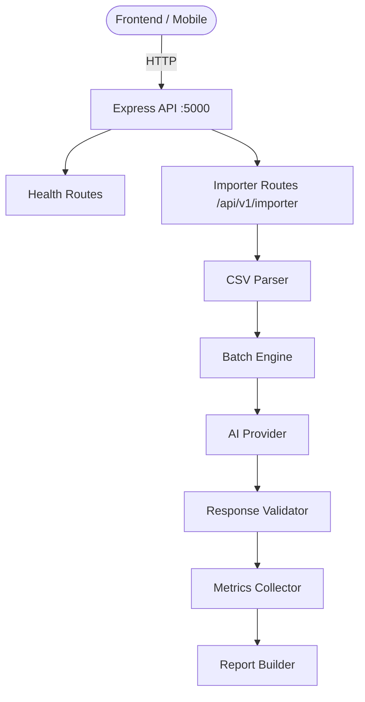

# AI CSV Importer — API Developer Guide

> **Version**: 1.0.0 | **Base URL**: `http://localhost:5000` | **Prefix**: `/api/v1`

This is the complete API reference for the **AI CSV Importer** backend platform. It is written for frontend developers, mobile developers, QA engineers, and API consumers who need to integrate with the system.

---

## Table of Contents

| Document | Description |
|:---|:---|
| [Authentication](./authentication.md) | API key and bearer token guide |
| [Uploads](./uploads.md) | CSV file upload endpoint |
| [Imports](./imports.md) | Import status and management |
| [Progress](./progress.md) | Progress polling and SSE events |
| [Reports](./reports.md) | Report formats and downloads |
| [Statistics](./statistics.md) | Statistics and metrics reference |
| [Errors](./errors.md) | Complete error code reference |
| [Rate Limits](./rate-limits.md) | Rate limiting policies and headers |
| [Pagination](./pagination.md) | Pagination and filtering |
| [Events](./events.md) | Internal event system reference |
| [Webhooks](./webhooks.md) | Webhook integration guide |
| [OpenAPI Spec](./openapi.yaml) | Machine-readable OpenAPI 3.1 |
| [Postman Collection](./postman_collection.json) | Postman import-ready collection |
| **Frontend Examples** | |
| [React](./frontend-examples/react.md) | React + TanStack Query |
| [Next.js](./frontend-examples/nextjs.md) | Next.js Server Actions + Client Components |
| [Axios](./frontend-examples/axios.md) | Axios client with interceptors |
| [Fetch](./frontend-examples/fetch.md) | Native Fetch API examples |
| [Flutter](./frontend-examples/flutter.md) | Flutter Dio client |

---

## Architecture Overview



---

## Quick Start

```bash
# Health check
curl http://localhost:5000/health

# Upload a CSV
curl -X POST http://localhost:5000/api/v1/importer/upload \
  -F "file=@contacts.csv"

# Get import status
curl http://localhost:5000/api/v1/importer/status
```

---

## Global Request Headers

Every request should include these headers:

| Header | Required | Value | Purpose |
|:---|:---|:---|:---|
| `Content-Type` | Conditional | `multipart/form-data` for uploads, `application/json` for JSON bodies | Payload format |
| `Accept` | Recommended | `application/json` | Response format |
| `X-Request-Id` | Optional | UUID string | Idempotency / tracing |

---

## Global Response Headers

Every response includes:

| Header | Value | Purpose |
|:---|:---|:---|
| `X-Request-Id` | `uuid-v4` | Unique request identifier for debugging |
| `RateLimit-Limit` | `100` | Maximum requests per window |
| `RateLimit-Remaining` | `0–100` | Remaining requests in window |
| `RateLimit-Reset` | Unix timestamp | Window reset time |

---

## Standard Response Envelope

All endpoints return a consistent JSON envelope.

### Success Response

```json
{
  "success": true,
  "message": "Human-readable success message",
  "data": { /* response payload */ },
  "meta": { /* pagination or additional metadata */ }
}
```

### Error Response

```json
{
  "success": false,
  "code": "ERROR_CODE_IN_SCREAMING_SNAKE_CASE",
  "message": "Human-readable error message",
  "errors": null
}
```

---

## TypeScript: Base Response Interfaces

```typescript
// Base response envelope — every endpoint conforms to this shape
interface ApiResponse<T = unknown> {
  success: boolean;
  message: string;
  data: T;
  meta: Record<string, unknown>;
}

// Error response envelope
interface ApiErrorResponse {
  success: false;
  code: string;
  message: string;
  errors: unknown | null;
}

// Union type for any response
type AnyApiResponse<T = unknown> = ApiResponse<T> | ApiErrorResponse;
```

---

## Base URL Configuration

| Environment | Base URL |
|:---|:---|
| Local Development | `http://localhost:5000` |
| Docker Compose | `http://backend:5000` |
| Production | `https://api.yourdomain.com` |

Configure in your `.env`:

```env
NEXT_PUBLIC_API_URL=http://localhost:5000
VITE_API_URL=http://localhost:5000
```

---

## Versioning

All versioned endpoints live under `/api/v1/`. Future versions will be introduced at `/api/v2/` with a deprecation notice published at least **90 days** in advance in the `CHANGELOG.md`.

| Version | Status | Base Path |
|:---|:---|:---|
| v1 | ✅ Active | `/api/v1` |
| v2 | 🔜 Planned | `/api/v2` |

---

## API Status

```
GET /health     — Liveness probe
GET /ready      — Readiness probe
GET /version    — Version info
```
