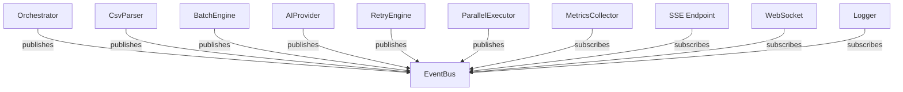

# Events Reference

The internal event bus publishes typed events during every stage of the import pipeline. This document is the authoritative reference for every event emitted by the system.

---

## Event System Architecture



---

## Base Payload Interfaces

```typescript
interface ImportEventPayload {
  importId: string;
  stage: string;
  timestamp: Date;
  statistics?: {
    totalRows: number;
    processedRows: number;
    successfulRows: number;
    failedRows: number;
    startedAt: Date;
    completedAt?: Date;
  };
  metadata?: Record<string, unknown>;
}

interface RetryEventPayload {
  operation: string;
  timestamp: Date;
  attempt?: number;
  delay?: number;        // ms until next retry
  duration?: number;     // ms the failed attempt took
  error?: Error;
  statistics?: unknown;
}

interface ParallelEventPayload {
  timestamp: Date;
  operation?: string;
  workerId?: string;
  batchIndex?: number;
  queueLength?: number;
  metrics?: unknown;
  error?: Error;
}

interface MetricsEventPayload {
  timestamp: Date;
  operation: string;
  importId?: string;
  metrics?: unknown;
  warning?: string;
  threshold?: number;
  value?: number;
  error?: Error;
}
```

---

## Complete Event Catalog

### Import Lifecycle

| Event | Payload | Emitter | Description |
|:---|:---|:---|:---|
| `import:started` | `ImportEventPayload` | Orchestrator | Pipeline started |
| `parsing:started` | `ImportEventPayload` | CsvParser | Streaming started |
| `parsing:completed` | `ImportEventPayload` | CsvParser | All rows read |
| `row:parsed` | `RowParsedPayload` | CsvParser | One row parsed |
| `batch:created` | `BatchPayload` | BatchEngine | Batch assembled |
| `batch:started` | `BatchPayload` | BatchEngine | Batch processing started |
| `batch:completed` | `BatchPayload` | BatchEngine | Batch done |
| `ai:started` | `AIPayload` | AIProvider | AI request dispatched |
| `ai:completed` | `AIPayload` | AIProvider | AI response received |
| `validation:started` | `ImportEventPayload` | Validator | Response validation starting |
| `validation:completed` | `ImportEventPayload` | Validator | Validation passed |
| `progress:changed` | `ProgressEventPayload` | Orchestrator | Progress % updated |
| `import:completed` | `ImportEventPayload` | Orchestrator | Entire import finished |
| `import:failed` | `ImportFailedPayload` | Orchestrator | Unrecoverable failure |
| `import:cancelled` | `ImportCancelledPayload` | Orchestrator | Cancellation requested |

### Retry Engine

| Event | Payload | Description |
|:---|:---|:---|
| `retry:started` | `RetryEventPayload` | Retry sequence beginning |
| `retry:attempt` | `RetryEventPayload` | Individual attempt number emitted |
| `retry:succeeded` | `RetryEventPayload` | Retry eventually succeeded |
| `retry:failed` | `RetryEventPayload` | Single attempt failed |
| `retry:exhausted` | `RetryEventPayload` | All attempts exhausted |
| `retry:cancelled` | `RetryEventPayload` | Retry cancelled by token |
| `circuit:opened` | `RetryEventPayload` | Circuit breaker open (failing fast) |
| `circuit:closed` | `RetryEventPayload` | Circuit breaker recovered |
| `circuit:half-opened` | `RetryEventPayload` | Circuit probing recovery |

### Parallel Processing

| Event | Payload | Description |
|:---|:---|:---|
| `worker:started` | `ParallelEventPayload` | Worker came online |
| `worker:stopped` | `ParallelEventPayload` | Worker went offline |
| `worker:idle` | `ParallelEventPayload` | Worker waiting for work |
| `worker:busy` | `ParallelEventPayload` | Worker processing a batch |
| `worker:recovered` | `ParallelEventPayload` | Worker recovered from error |
| `queue:full` | `ParallelEventPayload` | Backpressure enabled |
| `queue:empty` | `ParallelEventPayload` | All work drained |
| `parallel:batch:queued` | `ParallelEventPayload` | Batch placed in queue |
| `parallel:batch:started` | `ParallelEventPayload` | Worker picked up batch |
| `parallel:batch:completed` | `ParallelEventPayload` | Batch completed by worker |
| `parallel:batch:failed` | `ParallelEventPayload` | Batch failed in worker |
| `parallel:started` | `ParallelEventPayload` | Executor started |
| `parallel:completed` | `ParallelEventPayload` | Executor finished all work |
| `parallel:cancelled` | `ParallelEventPayload` | Executor cancelled |
| `backpressure:enabled` | `ParallelEventPayload` | Queue pressure active |
| `backpressure:disabled` | `ParallelEventPayload` | Queue pressure cleared |

### Metrics & Warnings

| Event | Payload | Threshold |
|:---|:---|:---|
| `metrics:statistics:started` | `MetricsEventPayload` | — |
| `metrics:statistics:updated` | `MetricsEventPayload` | — |
| `metrics:report:generated` | `MetricsEventPayload` | — |
| `metrics:collected` | `MetricsEventPayload` | — |
| `metrics:cost_threshold:exceeded` | `MetricsEventPayload` | Configurable USD |
| `metrics:high_memory:warning` | `MetricsEventPayload` | Memory % |
| `metrics:high_retry:warning` | `MetricsEventPayload` | Retry rate % |
| `metrics:slow_batch:warning` | `MetricsEventPayload` | Batch ms threshold |
| `metrics:slow_provider:warning` | `MetricsEventPayload` | Provider ms threshold |

---

## SSE Event Format (Planned)

Once the SSE endpoint is available, each event will be formatted as:

```
id: <sequential-id>
event: <event-name>
data: <JSON-serialized-payload>
retry: 3000

```

Example stream:

```
id: 1
event: import:started
data: {"importId":"abc-123","stage":"parsing","timestamp":"2026-07-10T01:00:00Z"}

id: 2
event: progress:changed
data: {"importId":"abc-123","stage":"ai_processing","progress":35,"timestamp":"2026-07-10T01:00:01Z"}

id: 3
event: import:completed
data: {"importId":"abc-123","stage":"completed","timestamp":"2026-07-10T01:00:08Z","statistics":{"totalRows":500,"successfulRows":493}}

```
