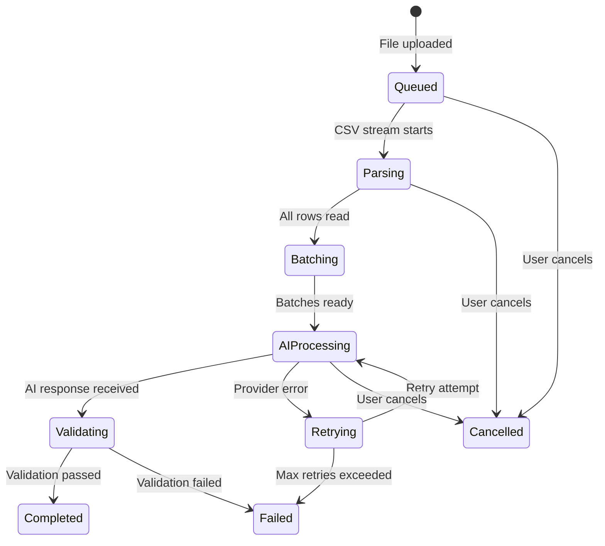

# Import Status API

The import module exposes endpoints to check the current state of the importer and retrieve per-import information.

---

## Endpoints Overview

| Method | Path | Description |
|:---|:---|:---|
| `GET` | `/api/v1/importer/status` | Get importer readiness status |
| `POST` | `/api/v1/importer/upload` | Upload CSV and start import → see [uploads.md](./uploads.md) |

---

## GET /api/v1/importer/status

Returns the current readiness state of the importer module. Use this endpoint to:
- Confirm the service is ready to accept uploads
- Build a "connection status" indicator in your UI
- Health-check the importer independently from the main `/health` endpoint

### Request

| Property | Value |
|:---|:---|
| **Method** | `GET` |
| **URL** | `/api/v1/importer/status` |
| **Auth** | None (v1.0.0) |
| **Rate Limit** | 100 req / 15 min |
| **Timeout** | 5 seconds |

### Query Parameters

None.

### Request Headers

| Header | Required | Value |
|:---|:---|:---|
| `Accept` | Recommended | `application/json` |

---

### Success Response

**HTTP 200 OK**

```json
{
  "success": true,
  "message": "Import status retrieved.",
  "data": {
    "status": "ready",
    "message": "Importer module is initialized."
  },
  "meta": {}
}
```

### TypeScript: Response Interface

```typescript
type ImporterStatus = "ready" | "busy" | "error" | "initializing";

interface ImportStatusData {
  status: ImporterStatus;
  message: string;
}

interface ImportStatusResponse {
  success: true;
  message: string;
  data: ImportStatusData;
  meta: Record<string, unknown>;
}
```

---

### Error Responses

#### 429 — Rate Limited

```json
{
  "success": false,
  "message": "Too many requests. Please try again later."
}
```

#### 500 — Internal Error

```json
{
  "success": false,
  "code": "INTERNAL_SERVER_ERROR",
  "message": "Internal Server Error",
  "errors": null
}
```

---

## Import Lifecycle States

An import moves through the following stages during processing. These states are emitted via the internal event bus and will be exposed via the SSE / polling progress endpoint in a future release.



### State Definitions

| State | Description |
|:---|:---|
| `queued` | File received, awaiting processing slot |
| `parsing` | CSV is being streamed and rows are being read |
| `batching` | Rows are being grouped into batches |
| `ai_processing` | Batches are being sent to the AI provider |
| `validating` | AI responses are being validated |
| `retrying` | A batch failed and is being retried |
| `completed` | All batches processed successfully |
| `cancelled` | Import was cancelled by the client |
| `failed` | Unrecoverable error occurred |

---

## TypeScript: Full Import Model

```typescript
type ImportStage =
  | "queued"
  | "parsing"
  | "batching"
  | "ai_processing"
  | "validating"
  | "retrying"
  | "completed"
  | "cancelled"
  | "failed";

interface ImportProgress {
  importId: string;
  stage: ImportStage;
  progress: number;             // 0–100
  totalRows: number;
  processedRows: number;
  successfulRows: number;
  failedRows: number;
  currentBatch?: number;
  totalBatches?: number;
  provider?: string;
  model?: string;
  startedAt: string;            // ISO 8601
  updatedAt: string;            // ISO 8601
  completedAt?: string;         // ISO 8601 — only when stage = "completed"
  error?: string;               // only when stage = "failed"
  cancellationReason?: string;  // only when stage = "cancelled"
}
```

---

## cURL Examples

### Get Importer Status

```bash
curl http://localhost:5000/api/v1/importer/status
```

Expected response:
```json
{
  "success": true,
  "message": "Import status retrieved.",
  "data": { "status": "ready", "message": "Importer module is initialized." },
  "meta": {}
}
```

---

## React Example: Polling Import Status

```tsx
import { useQuery } from "@tanstack/react-query";
import axios from "axios";

function useImporterStatus() {
  return useQuery({
    queryKey: ["importer", "status"],
    queryFn: async () => {
      const { data } = await axios.get("/api/v1/importer/status");
      return data.data as { status: string; message: string };
    },
    refetchInterval: 5000,         // Poll every 5 seconds
    staleTime: 4000,
  });
}

function ImporterStatusBadge() {
  const { data, isLoading, isError } = useImporterStatus();

  if (isLoading) return <span className="badge neutral">Checking…</span>;
  if (isError)   return <span className="badge error">Offline</span>;

  return (
    <span className={`badge ${data?.status === "ready" ? "success" : "warning"}`}>
      {data?.status ?? "unknown"}
    </span>
  );
}
```
