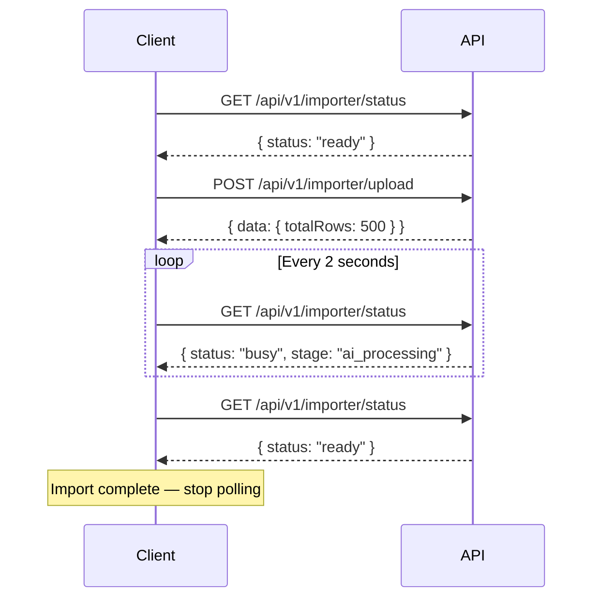

# Progress Tracking Guide

Progress information flows through the internal event bus. This guide documents the event catalog and all currently-available and planned mechanisms for consuming progress data from the frontend.

---

## Mechanisms Available

| Mechanism | Status | Endpoint | Best For |
|:---|:---|:---|:---|
| **Polling** | ✅ Available (via status) | `GET /api/v1/importer/status` | Simple UIs, React Native |
| **Server-Sent Events (SSE)** | 🔜 Planned | `GET /api/v1/importer/:id/events` | Real-time dashboards |
| **WebSocket** | 🔜 Planned | `ws://host/ws/import/:id` | Low-latency, high-frequency updates |

---

## Current: Polling

The simplest and most compatible approach. Poll the status endpoint periodically.

### Strategy

- Poll every **2 seconds** during active imports
- Poll every **10 seconds** for queue position
- Stop polling when `stage === "completed"` or `stage === "failed"`
- Use **exponential backoff** if you receive 429 responses

### Polling Flow



---

### Polling — React Hook

```typescript
import { useQuery } from "@tanstack/react-query";
import axios from "axios";
import { useState } from "react";

type ImportStage =
  | "idle" | "queued" | "parsing" | "batching"
  | "ai_processing" | "validating" | "retrying"
  | "completed" | "cancelled" | "failed";

interface PollStatus {
  status: string;
  stage?: ImportStage;
  progress?: number;
}

const TERMINAL_STAGES: ImportStage[] = ["completed", "cancelled", "failed"];

function useImportProgress(importId: string | null) {
  return useQuery({
    queryKey: ["import", "progress", importId],
    queryFn: async (): Promise<PollStatus> => {
      const { data } = await axios.get("/api/v1/importer/status");
      return data.data;
    },
    enabled: !!importId,
    refetchInterval: (data) => {
      // Stop polling when terminal stage is reached
      if (data?.stage && TERMINAL_STAGES.includes(data.stage)) return false;
      return 2000;
    },
    staleTime: 1500,
  });
}
```

---

## Planned: Server-Sent Events (SSE)

SSE is a one-way stream from server to client over a persistent HTTP connection. It is the recommended approach for real-time import progress dashboards.

### Planned Endpoint

```
GET /api/v1/importer/:importId/events
Accept: text/event-stream
```

### SSE Event Format

Each event is a standard SSE message:

```
event: progress:changed
data: {"importId":"abc-123","stage":"ai_processing","progress":62,"processedRows":310,"totalRows":500}

event: batch:completed
data: {"importId":"abc-123","batchNumber":3,"totalRows":500}

event: import:completed
data: {"importId":"abc-123","stage":"completed","progress":100}
```

### TypeScript: SSE Event Interfaces

```typescript
// Base payload for all import events
interface ImportEventPayload {
  importId: string;
  stage: string;
  timestamp: string;        // ISO 8601
  statistics?: ImportStats;
  metadata?: Record<string, unknown>;
}

interface ImportStats {
  totalRows: number;
  processedRows: number;
  successfulRows: number;
  failedRows: number;
  startedAt: string;
  completedAt?: string;
}

// progress:changed
interface ProgressEventPayload extends ImportEventPayload {
  progress: number;         // 0–100
}

// row:parsed
interface RowParsedPayload extends ImportEventPayload {
  rowNumber: number;
  rawRow: Record<string, unknown>;
}

// batch:created / batch:started / batch:completed
interface BatchPayload extends ImportEventPayload {
  batchNumber: number;
  totalRows: number;
}

// ai:started / ai:completed
interface AIPayload extends ImportEventPayload {
  batchNumber: number;
  provider: string;
  model: string;
}

// import:failed
interface ImportFailedPayload extends ImportEventPayload {
  error: string;
}

// import:cancelled
interface ImportCancelledPayload extends ImportEventPayload {
  reason: string;
}
```

### Planned: SSE Client (React)

```typescript
import { useEffect, useState } from "react";

interface ProgressState {
  stage: string;
  progress: number;
  processedRows: number;
  totalRows: number;
}

function useSSEProgress(importId: string | null) {
  const [progress, setProgress] = useState<ProgressState | null>(null);
  const [isComplete, setIsComplete] = useState(false);
  const [error, setError] = useState<string | null>(null);

  useEffect(() => {
    if (!importId) return;

    const sse = new EventSource(
      `/api/v1/importer/${importId}/events`
    );

    sse.addEventListener("progress:changed", (e) => {
      const data: ProgressState = JSON.parse(e.data);
      setProgress(data);
    });

    sse.addEventListener("import:completed", () => {
      setIsComplete(true);
      sse.close();
    });

    sse.addEventListener("import:failed", (e) => {
      const data = JSON.parse(e.data);
      setError(data.error);
      sse.close();
    });

    sse.addEventListener("import:cancelled", () => {
      setError("Import was cancelled");
      sse.close();
    });

    sse.onerror = () => {
      setError("Connection to server lost");
      sse.close();
    };

    return () => sse.close();
  }, [importId]);

  return { progress, isComplete, error };
}
```

---

## Planned: WebSocket

For real-time dashboards with sub-second latency, WebSocket is the preferred option.

### Planned URL

```
ws://localhost:5000/ws/import/:importId
```

### Event Message Format

```typescript
interface WsMessage {
  event: string;
  payload: unknown;
}
```

### WebSocket Client

```typescript
function connectImportWebSocket(importId: string, onEvent: (msg: WsMessage) => void) {
  const ws = new WebSocket(`ws://localhost:5000/ws/import/${importId}`);

  ws.onmessage = (e) => {
    const msg: WsMessage = JSON.parse(e.data);
    onEvent(msg);
  };

  ws.onclose = () => console.log("Import WS disconnected");

  return () => ws.close();
}
```

---

## Full Event Catalog

All events emitted by the internal event bus. Available to SSE and WebSocket consumers once those endpoints are implemented.

### Import Lifecycle Events

| Event Name | Payload Type | Description |
|:---|:---|:---|
| `import:started` | `ImportEventPayload` | Import pipeline has begun |
| `parsing:started` | `ImportEventPayload` | CSV streaming started |
| `parsing:completed` | `ImportEventPayload` | All rows read |
| `row:parsed` | `RowParsedPayload` | Single CSV row read |
| `batch:created` | `BatchPayload` | New batch assembled |
| `batch:started` | `BatchPayload` | Batch processing started |
| `batch:completed` | `BatchPayload` | Batch processed successfully |
| `ai:started` | `AIPayload` | AI request sent |
| `ai:completed` | `AIPayload` | AI response received |
| `validation:started` | `ImportEventPayload` | Validation pass starting |
| `validation:completed` | `ImportEventPayload` | Validation completed |
| `import:completed` | `ImportEventPayload` | Entire import done |
| `import:failed` | `ImportFailedPayload` | Unrecoverable failure |
| `import:cancelled` | `ImportCancelledPayload` | User-requested cancellation |
| `progress:changed` | `ProgressEventPayload` | Progress % updated |

### Retry Events

| Event Name | Description |
|:---|:---|
| `retry:started` | Retry sequence beginning |
| `retry:attempt` | Individual retry attempt |
| `retry:succeeded` | Retry eventually succeeded |
| `retry:failed` | Single attempt failed |
| `retry:exhausted` | All attempts exhausted |
| `retry:cancelled` | Retry cancelled (token cancelled) |
| `circuit:opened` | Circuit breaker opened (failing fast) |
| `circuit:closed` | Circuit breaker closed (recovered) |
| `circuit:half-opened` | Circuit breaker probe attempt |

### Parallel Processing Events

| Event Name | Description |
|:---|:---|
| `worker:started` | A worker started |
| `worker:stopped` | A worker stopped |
| `worker:idle` | A worker has no work |
| `worker:busy` | A worker is processing |
| `queue:full` | Backpressure enabled |
| `queue:empty` | All work drained |
| `parallel:started` | Parallel execution started |
| `parallel:completed` | Parallel execution finished |
| `parallel:cancelled` | Parallel execution cancelled |

### Metrics / Warning Events

| Event Name | Description |
|:---|:---|
| `metrics:cost_threshold:exceeded` | Cost exceeded configured limit |
| `metrics:high_memory:warning` | Memory usage above threshold |
| `metrics:high_retry:warning` | Retry rate above threshold |
| `metrics:slow_batch:warning` | Batch processing taking too long |
| `metrics:slow_provider:warning` | AI provider responding slowly |

---

## Progress Percentage Calculation

Progress is calculated as:

```
progress = (processedRows / totalRows) × 100
```

If `totalRows` is not yet known (e.g. still parsing), the progress will be `0` until parsing completes.

### Stage to Percentage Map (Approximate)

| Stage | Approximate Progress |
|:---|:---|
| `queued` | 0% |
| `parsing` | 0–10% |
| `batching` | 10–15% |
| `ai_processing` | 15–90% (scales with batch completion) |
| `validating` | 90–98% |
| `completed` | 100% |
| `failed` | Stays at last known % |
| `cancelled` | Stays at last known % |
