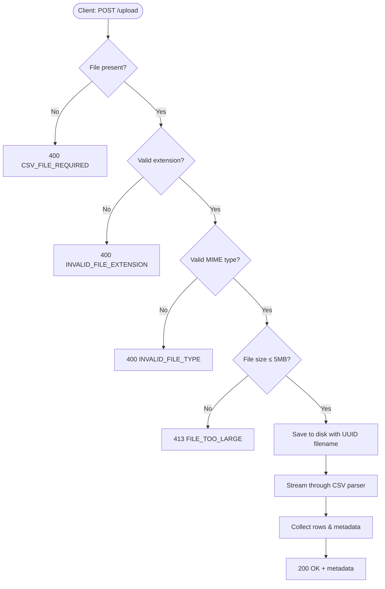

# Upload API

The upload endpoint accepts a single CSV file and streams it through the import pipeline.

---

## Endpoints Overview

| Method | Path | Description |
|:---|:---|:---|
| `POST` | `/api/v1/importer/upload` | Upload a CSV file for processing |

---

## POST /api/v1/importer/upload

Upload a CSV file. The file is stored server-side, then streamed through the CSV parser and processed in batches by the AI provider.

### Request

| Property | Value |
|:---|:---|
| **Method** | `POST` |
| **URL** | `/api/v1/importer/upload` |
| **Content-Type** | `multipart/form-data` |
| **Auth** | None (v1.0.0) |
| **Rate Limit** | 100 req / 15 min |
| **Timeout** | 30 seconds |

### Multipart Form Fields

| Field | Type | Required | Description |
|:---|:---|:---|:---|
| `file` | `File` | ✅ Yes | The CSV file to import |

### File Validation Rules

| Rule | Value | Error Code |
|:---|:---|:---|
| Max file size | **5 MB** | `FILE_TOO_LARGE` |
| Allowed extensions | `.csv` | `INVALID_FILE_EXTENSION` |
| Allowed MIME types | `text/csv`, `application/vnd.ms-excel` | `INVALID_FILE_TYPE` |
| Field name | Must be `file` | `CSV_FILE_REQUIRED` |

### Upload Flow Diagram



---

### Success Response

**HTTP 200 OK**

```json
{
  "success": true,
  "message": "CSV parsed successfully.",
  "data": {
    "headers": ["first_name", "last_name", "email", "company"],
    "totalRows": 247,
    "skippedRows": 3,
    "durationMs": 142
  },
  "meta": {}
}
```

### TypeScript: Success Interface

```typescript
interface CsvStreamMetadata {
  headers: string[];        // Column names from CSV header row
  totalRows: number;        // Total non-empty data rows parsed
  skippedRows: number;      // Rows skipped (empty lines)
  durationMs: number;       // Time taken to stream the file in milliseconds
}

interface UploadSuccessResponse {
  success: true;
  message: string;
  data: CsvStreamMetadata;
  meta: Record<string, unknown>;
}
```

---

### Error Responses

#### 400 — No File Attached

```json
{
  "success": false,
  "code": "CSV_FILE_REQUIRED",
  "message": "CSV file is required.",
  "errors": null
}
```

#### 400 — Invalid File Extension

```json
{
  "success": false,
  "code": "INVALID_FILE_EXTENSION",
  "message": "Only CSV files are allowed.",
  "errors": null
}
```

#### 400 — Invalid MIME Type

```json
{
  "success": false,
  "code": "INVALID_FILE_TYPE",
  "message": "Invalid file type.",
  "errors": null
}
```

#### 413 — File Too Large (Multer)

```json
{
  "success": false,
  "code": "FILE_TOO_LARGE",
  "message": "File too large. Maximum allowed size is 5MB.",
  "errors": null
}
```

#### 429 — Rate Limit Exceeded

```json
{
  "success": false,
  "message": "Too many requests. Please try again later.",
  "errors": null
}
```

#### 500 — Internal Server Error

```json
{
  "success": false,
  "code": "INTERNAL_SERVER_ERROR",
  "message": "Internal Server Error",
  "errors": null
}
```

---

### Status Code Summary

| Code | Meaning |
|:---|:---|
| `200` | Upload and parse successful |
| `400` | Validation error (missing file, wrong type/extension) |
| `413` | File exceeds 5MB limit |
| `429` | Rate limit exceeded |
| `500` | Unexpected server error |

---

## cURL Examples

### Successful Upload

```bash
curl -X POST http://localhost:5000/api/v1/importer/upload \
  -F "file=@/path/to/contacts.csv"
```

### Missing File (triggers 400)

```bash
curl -X POST http://localhost:5000/api/v1/importer/upload
```

### Wrong File Type (triggers 400)

```bash
curl -X POST http://localhost:5000/api/v1/importer/upload \
  -F "file=@/path/to/document.pdf"
```

---

## Axios Example

```typescript
import axios from "axios";

interface UploadResult {
  success: boolean;
  message: string;
  data: {
    headers: string[];
    totalRows: number;
    skippedRows: number;
    durationMs: number;
  };
  meta: Record<string, unknown>;
}

async function uploadCsv(
  file: File,
  onProgress?: (percent: number) => void
): Promise<UploadResult> {
  const form = new FormData();
  form.append("file", file);

  const { data } = await axios.post<UploadResult>(
    "/api/v1/importer/upload",
    form,
    {
      headers: { "Content-Type": "multipart/form-data" },
      onUploadProgress: (event) => {
        if (event.total) {
          const percent = Math.round((event.loaded / event.total) * 100);
          onProgress?.(percent);
        }
      },
    }
  );

  return data;
}
```

---

## Fetch API Example

```typescript
async function uploadCsvFetch(file: File): Promise<UploadResult> {
  const form = new FormData();
  form.append("file", file);

  const response = await fetch("/api/v1/importer/upload", {
    method: "POST",
    body: form,
    // Do NOT set Content-Type — browser sets it automatically with boundary
  });

  if (!response.ok) {
    const error = await response.json();
    throw new Error(error.message ?? "Upload failed");
  }

  return response.json();
}
```

---

## React + TanStack Query Example

```tsx
import { useMutation } from "@tanstack/react-query";
import axios from "axios";

function useUploadCsv() {
  return useMutation({
    mutationFn: async ({ file, onProgress }: {
      file: File;
      onProgress?: (pct: number) => void;
    }) => {
      const form = new FormData();
      form.append("file", file);

      const { data } = await axios.post("/api/v1/importer/upload", form, {
        onUploadProgress: (e) => {
          if (e.total) onProgress?.(Math.round((e.loaded / e.total) * 100));
        },
      });
      return data;
    },
  });
}

function UploadButton() {
  const { mutate, isPending, isSuccess, data, error } = useUploadCsv();

  return (
    <div>
      <input
        type="file"
        accept=".csv"
        onChange={(e) => {
          const file = e.target.files?.[0];
          if (file) mutate({ file });
        }}
        disabled={isPending}
      />
      {isPending && <p>Uploading…</p>}
      {isSuccess && <p>Parsed {data.data.totalRows} rows</p>}
      {error && <p className="error">{(error as Error).message}</p>}
    </div>
  );
}
```

---

## Frontend Best Practices

1. **Never set `Content-Type` manually** for multipart uploads — let the browser calculate the `boundary` parameter.
2. **Validate file size client-side** before uploading to save bandwidth:
   ```typescript
   const MAX_SIZE = 5 * 1024 * 1024; // 5MB
   if (file.size > MAX_SIZE) {
     alert("File must be smaller than 5MB");
     return;
   }
   ```
3. **Validate MIME type client-side**:
   ```typescript
   const allowed = ["text/csv", "application/vnd.ms-excel"];
   if (!allowed.includes(file.type)) {
     alert("Only CSV files are accepted");
     return;
   }
   ```
4. **Show upload progress** using `onUploadProgress` (Axios) or `ReadableStream` (Fetch).
5. **Disable the upload button** while `isPending` to prevent double-submission.
6. **Handle 413 separately** — show a "file too large" message rather than a generic error.
